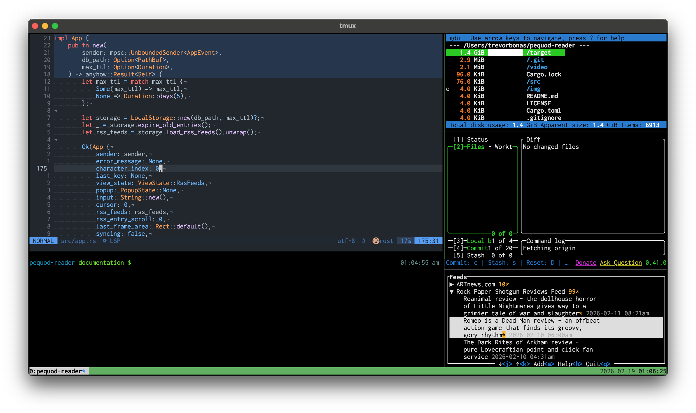

# Pequod Reader

Pequod Reader is a TUI RSS reader designed to fit within the smallest terminal pane possible.

<video src="https://github.com/user-attachments/assets/bbafd0b2-6fc1-4865-b779-828cc4e8c57d" height="500"></video>

## Table of Contents

- [Install](#install)
- [Uninstall](#uninstall)
- [Why?](#why)
- [Features](#features)
- [FAQ](#faq)

## Install

On the [Releases page](https://github.com/trevorbonas/pequod-reader/releases), download the binary matching your system and add the binary to your `PATH`. For example, on macOS, assuming `/usr/local/bin` is already a part of your `PATH`:

```shell
wget https://github.com/trevorbonas/pequod-reader/releases/download/v0.1.0/pequod-reader-v0.1.0-macos-x86_64.tar.gz
tar -xzf pequod-reader-v0.1.0-macos-x86_64.tar.gz
sudo cp target/x86_64-apple-darwin/release/pequod-reader /usr/local/bin
```

## Uninstall

To uninstall Pequod Reader:
1. Remove the `pequod-reader` binary. For example, on Linux:
   
   ```shell
   sudo rm /usr/local/bin/pequod-reader
   ```
2. Remove the program's `rss.db` SQLite database. For example, on Linux:

   ```shell
   rm ~/.local/share/pequod-reader/rss.db
   ```
   See the [Local Storage](#local-storage) section below for where your RSS feed data is stored.

## Why?

When using a terminal with multiple panes and multiple applications running, terminal real estate is limited. Pequod Reader is designed to run in a small pane alongside many other programs. For example:



Pequod Reader is in the bottom right pane. Other programs depicted have no relation to this project.

## Features

### Keybindings

Pequod Reader supports basic Vim-like navigation keybindings. The full set of supported keybindings are:

| Key(s)       | View Mode(s)  | Action                      |
|--------------|---------------|-----------------------------|
| `j` or ↓     | Feeds & entry | Scroll down                 |
| `k` or ↑     | Feeds & entry | Scroll up                   |
| `ctrl` + `d` | Feeds & entry | Scroll half page down       |
| `ctrl` + `u` | Feeds & entry | Scroll half page up         |
| `gg`         | Feeds & entry | Go to top                   |
| `G`          | Feeds & entry | Go to bottom                |
| `Enter`      | Feeds         | Select entry or expand feed |
| `a`          | Feeds         | Add new RSS feed            |
| `d`          | Feeds         | Delete RSS feed             |
| `s`          | Feeds         | Sync all RSS feeds          |
| `c`          | Feeds         | Collapse a feed             |
| `q`          | Feeds         | Quit Pequod Reader          |
| `h`          | Feeds         | Show feeds help popup       |
| `f`          | Entry         | Fetch full entry HTML       |
| `o`          | Entry         | Open entry in your browser  |
| `q`          | Entry         | Return to feeds view        |
| `h`          | Entry         | Show entry help popup       |

### Local Storage

Pequod Reader saves all RSS feeds and entries to a local SQLite database:
- On Linux, this is located in `~/.local/share/pequod-reader/rss.db`.
- On macOS, this is located in `~/Library/Application\ Support/com.trevorbonas.pequod-reader/rss.db`
- On Windows, this is located in `%AppData%\Roaming\trevorbonas\pequod-reader\data\rss.db`.

### Full Entry Reading

Often, RSS feeds will not provide the entire body of an entry. Instead, a small summary is provided. When reading an entry, pressing `s` will make Pequod Reader attempt to scrape the HTML for an entry. However, this does not always work. If this does not work, press `o` to open the entry in your browser.

## FAQ

### Why is it called Pequod Reader?

Originally, Pequod Reader allowed reading entire books in the terminal. The _Pequod_ is the ship that Captain Ahab helms in _Moby Dick_.

### Are there plans to support other providers?

Yes, there are plans to support providers other than local storage in a future release. For now, using local storage is simpler and means the reader can be used immediately, without needing to sign in.

## License

See the [`LICENSE`](./LICENSE) file for more information about the project's license.
